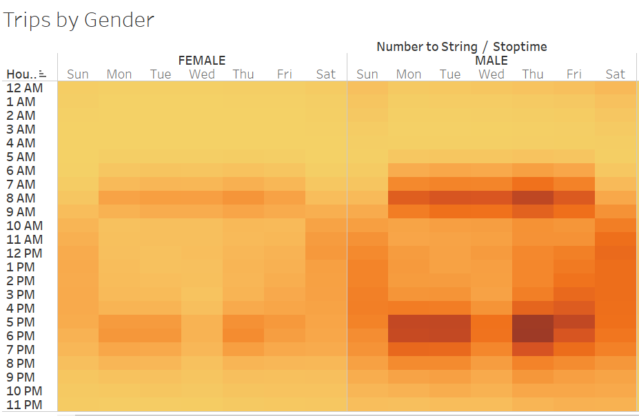
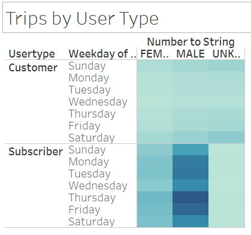
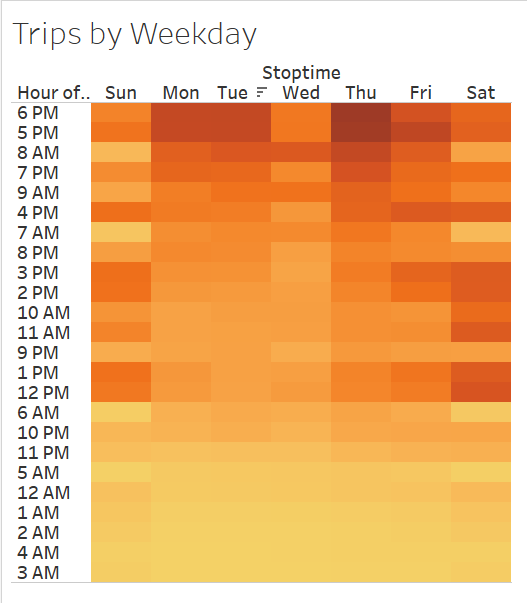
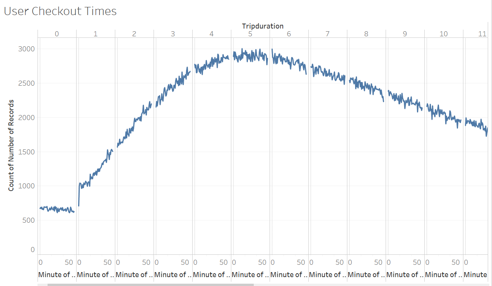
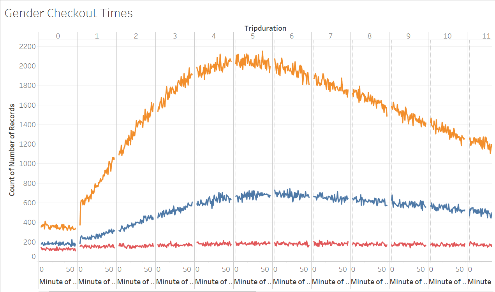
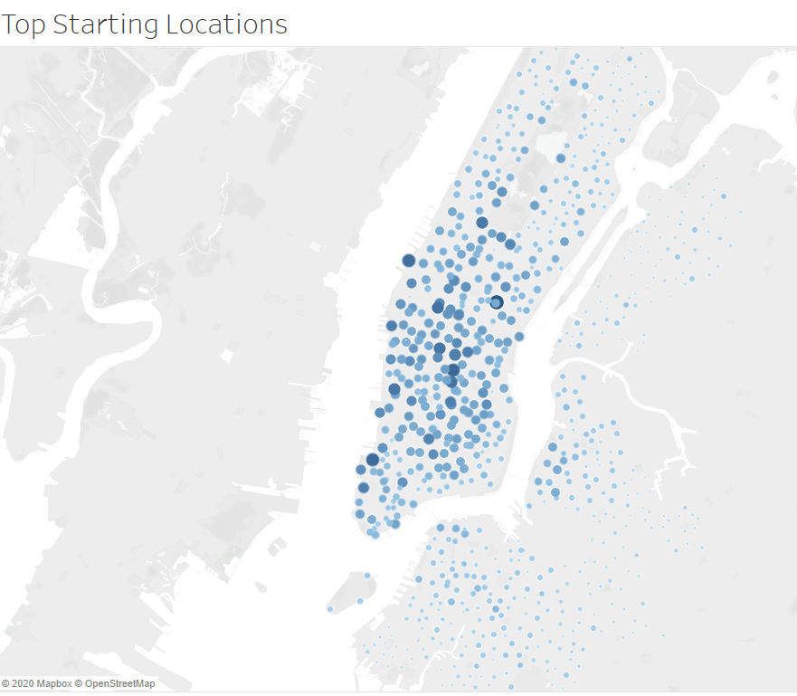
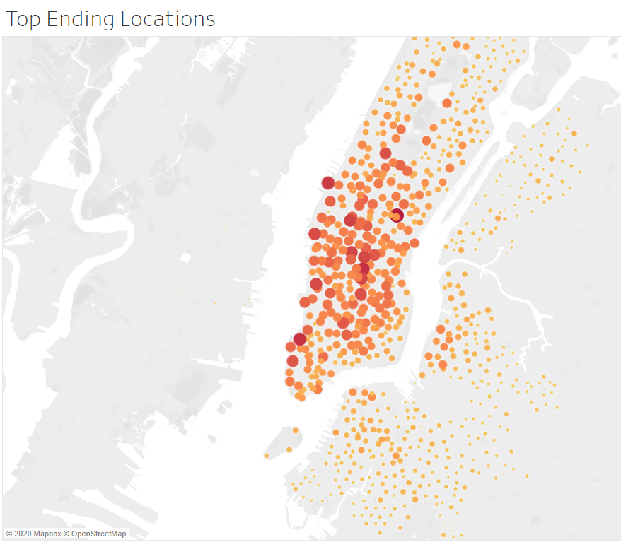

# Bikesharing

## Overview of Project

The purpose of the citibike analysis project is to explore whether the NYC Citibike business could be viable in Des Moines as well, providing residents and visitors a more eco-friendly and easy way to get around town. 

## Results

To make projections about the profitability and success of a citibike program in Des Moines, we leveraged the NYC data and noted the following: 

1. Men used citibikes significantly more than women during peak hours of the day, as depicted in this side by side heat map below. Please note that where genders are undefined, we have excluded the graph as it does not add value to the business case. 

 

2. There are more subscribers than there are one time customers, as depicted in the image of the analysis performed below. Additionally, similar to our discovery in step one, there are more trips made by male subscriber users than all other combinations. 

 

3. When we performed an analysis to see trips by weekday, we noticed that the peak hours generally fall within 5pm to 7pm where customers and subscribers are commuting home from work or school. Please see heat map below: 

 

4. Although both genders checkout citibike more during peak hours, we can see via the graph below that men who are subscribes tend to curve a lot higher than women for citibike utilization across all time periods. Please see the two graphs below, the first one depicting all check out times for all users, whereas the second one parses out different genders. 

 
 

5. Lastly, we analyzed the top starting locations and top ending locations for checkin and checkouts and noticed that they appear consistent and almost overlap, with ending locations having more points outside of the immediate city center of Manhattan. This will give us a good idea as to where we can start placing citibike stations (in the more popular areas). 

 
 

## Summary

Based on the analysis performed, it appears that our target audience should be men who are subscribers, meaning that they are utilizing citibike more on a daily basis as a form of public transport, as opposed to one time users. This is further proven by the fact that most of the usage occurs during 5 to 7 pm when city folks are getting off of work and ready to commute home. As such, citibike may be a great option for Des Moines, even if Des Moines doesn't have as many tourists as NYC, since most of the bike riders are regular users. 

If we are to perform additional visualizations, I would recommend the following: 

1. Understanding gender versus trip duration, to see if men are generally riding longer than women or vice versa
2. Understanding user type versus trip duration, to see if subscribers are generally taking shorter routes between work to home and customers who rent bikes are generally looking for longer routes for sightseeing. 
